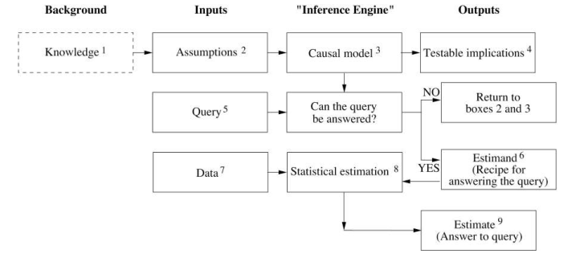

```{r setup, include=FALSE}
knitr::opts_chunk$set(echo = TRUE, fig.align = "center", comment = "",
                      fig.width = 5, fig.height = 3)

```             

## Summary

### I: Mind Over Data

>If I could sum up the message of this book in one pithy phrase, it would be that you are smarter than your data. Data do not understand causes and effects; humans do.

The "New Science of Causation" is "_new_" because Pearl has come up with a notation —a vocabulary— to express causal questions.

>The calculus of causation consists of two languages: __causal diagrams__, to express what we know, and a __symbolic language__, resembling algebra, to express what we want to know. 

>The causal diagrams are simply dot-and-arrow pictures that summarize our existing scientific knowledge. The dots represent quantities of interest, called "variables", and the arrows represent known or supsected causal relationships between those variables —namely, which variable "_listens_" to which others. 

>Side by side with thisdiagrammatic "language of knowledge", we also have a symbolic "language of queries", to express the questions we want answers to. For example, if we are interested in the effect of a drug ($D$) on lifespan ($L$), then our query might be written symbolically as: $P(L \mid do(D))$. In other words, what is the probability ($P$) that a typical patient would survive $L$ years if made to take the drug? This question describes what epidemiologists would call an _intervention_ or a _treatment_ and corresponds to what we measure in a clinical trial. 

The standard notation to describe patients who volunatirly take the drug is $P(L \mid D)$, which is just conditional probability. The difference between $P(L \mid D)$ and $P(L \mid do(D))$ may be enormous.

>This difference between _seeing_ and _doing_ is fundamental and explains why we do not regard the falling barometer to be a cause of the coming storm. Seeing the barometer fall increases the probability of the storm, while focing it to fall does not affect this probability. 

___The causal inference engine___

Pear then describes a workflow which he terms the "inference engine". It has three inputs and three outpus. The dashed box is not part of the	workflow but is required to start off.

```{r, echo=FALSE, out.width="80%"}

```

EXPAND WHEN YOU FINISH THE BOOK

### II: The Ladder of Causation

The ladder of causation is the main metaphor in this book. There are three levels in this ladder. And each additional level increases the complexities of the queries we can answer.

1. Seeing. The detection of regularities in our environment. 

    _What if I see ...?_

2. Doing. Predicting the effect(s) of deliberate interventions in our environment and choosing among these interventions to produce a desired outcome.

    _What if I do ...? __How__?_

3. Imagining. Having a "theory" for why things work the way they do. 
    
    _What if I had done ...? __Why__?_

Note, _I_ have trouble telling apart how and why questions. Apparently, both Donald Rubin and Hernán & Robins (2020) don't distinguish between these two levels. Recall the _"No causation without manipulation"_ dictum rooted in the potential outcomes framework. This confusion is even stronger when Pearl reservers the term "_counterfactual_" to the third level.

Thus, it's no coincidence that this distinction here is one of the most controversial points in the book and that —as Pearl notes— this "what would have happened if" understanding of counterfactual is branded as unscientific by many researchers.

Another possible interpretation of this three-way distinction is that Pearl uses the _do-calculus_ as a tool for task # 2, and uses _causal diagrams_ as a tool for task # 3.

__Causal diagrams__

38, 41 AAAND STUFF FROM CHAPTER 2 (two bits)

nodes are random variables and edges are probabilistic relationships  between variables (i.e. conditional probabilities)

```{r, message=FALSE}
library(ggdag)
theme_set(ggdag::theme_dag())

ggdag::dagify(
  death ~ reaction + smallpox,
  smallpox ~ vaccination,
  reaction ~ vaccination
) %>% ggdag(text_size = 2.5, node_size = 18)

```

### III: Bayesian Networks

Bayes' rule  $\to$ two-node networks $\to$ three junctions

A Bayesian network describes the joint probability distribution for a set of variables.

$$
\begin{align}
&P(x_1, ..., x_n) = \prod_{i \in V} p(x_i \mid \text{pa}(x_i)) \\\\
&\text{where } \ \text{pa}(x_i) = \text{all parents of } x_i
\end{align}
$$


## Loose Quotes
