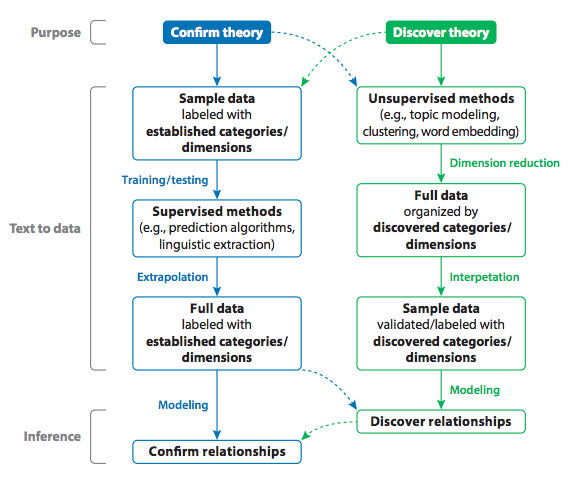
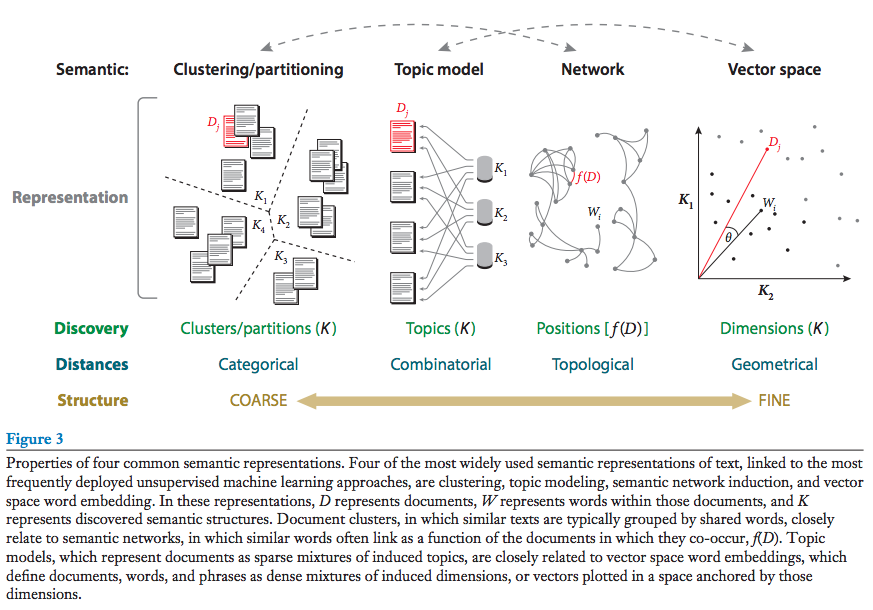
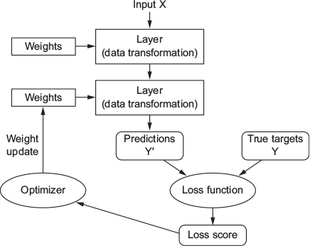
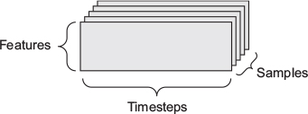
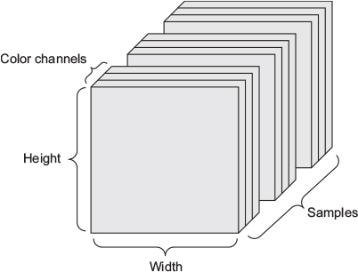

```{r setup, include=FALSE}
knitr::opts_chunk$set(echo = TRUE, comment = "",
                      fig.align = "center", fig.width = 4, fig.height = 3,
                      cache = TRUE)

## Packages
library(tidyverse)

## Other
theme_set(
  theme_bw(base_family = "Avenir", base_line_size = 0)
  )

plot_settings <- function() {
  par(mar = c(3, 3, 3, 1), mgp = c(2, 0.5, 0), tck = -0.02, 
    family = "Avenir", cex = 0.8, pch = 20)
}

make_table <- function(df, digits = 3, caption = "") {
  knitr::kable(df, "html", digits = digits, caption = caption) %>% 
  kableExtra::kable_styling(full_width = FALSE, 
                            bootstrap_options = "bordered")
}

```

Resources:

1. [Silge](https://juliasilge.com/blog/tidy-word-vectors/)

2. [Keras](https://blogs.rstudio.com/tensorflow/posts/2017-12-22-word-embeddings-with-keras/)


****

## Introduction

****

### Text as Data

***

Taken from: Grimmer, J., & Stewart, B. M. (2013). "Text as Data: The Promise and Pitfalls of Automatic Content Analysis Methods for Political Texts". *Political Analysis*

***

Politics and political conflict often occur in the written and spoken word. Scholars have long recognized this, but the massive costs of analyzing even moderately sized collections of texts have hindered their use in political science research. Here lies the promise of automated text analysis: it substantially reduces the costs of analyzing large collections of text.

However, the complexity of language implies that automated content analysis methods will never replace careful and close reading of texts. Rather, the new methods are best thought of as *amplifying* and *augmenting* careful reading and thoughtful analysis. Further, automated content methods are *incorrect* models of language. This means that the performance of any one method on a new data set cannot be guaranteed, and therefore validation is essential when applying automated content methods.

**The Four Principles of Automated Text Analysis**:

1. All quantitative models of language are wrong --*but some are useful*

    The data generation process for *any* text is a mystery --even to linguists. If any one sentence has complicated dependency structure, its meaning could change drastically with the inclusion of new words, and the sentence context could drastically change its meaning. Consider, for example, the classic joke “Time flies like an arrow. Fruit flies like a banana.” This joke relies on the extreme complexity of parsing the sentence, using the change in our understanding of “flies like” as the sentence progresses --from metaphorical to literal.

2. Quantitative methods augment humans, they do not replace them.

    A deep understanding of the texts is one of the key advantages of the social scientist in applying automated methods; researchers must still guide the process, make modeling decisions, and interpret the output of the models. All these require the close reading of texts and thoughtful analysis by the researcher.

    Rather than replace humans, computers amplify human abilities. The most productive line of inquiry, therefore, is not in identifying how automated methods can obviate the need for researchers to read their text. Rather, the most productive line of inquiry is to identify the best way to use both humans *and* automated methods for analyzing texts.

3. There is no globally best method for automated text analysis.

    Different data sets and different research questions often lead to different quantities of interest. This is particularly true with text models. Sometimes, the goal is to identify the words that distinguish the language of groups; the proportion of documents that fall within a predetermined set of categories; to discover a new way to organize texts; to locate actors in a spatial model; etc.

    Each of the research questions imply *different models*, or families of models, to be used for analysis, and different methods of validation.

4. Validate, validate, validate.

    Automated text analysis methods can substantially reduce the costs and time of analyzing massive collections of political texts. When applied to any one problem, however, the output of the models may be misleading or simply wrong. Therefore, it is incumbent upon the researcher to validate their use of automated text analysis.  This validation can take several forms. When categories are known in a calculation problem, scholars must demonstrate that the supervised methods are able to reliably replicate human coding. Validation for unsupervised methods is less direct. To validate the output of an unsupervised method, scholars must combine experimental, substantive, and statistical evidence to demonstrate that the measures produced correspond with the concepts claimed to underly them. 
    


### Machine Translation

****

Taken from: Evans, J. A., & Aceves, P. (2016). "Machine Translation: Mining Text for Social Theory". *Annual Review of Sociology*

****

A vast expanse of information about what people do, know, think, and feel lies embedded in text. More recently, an unfolding universe of digital text has generated a call for new information representations, natural language processing (NLP), and information retrieval (IR) and extraction (IE) tools that can filter, search, summarize, classify, and extract information from text.

Social theory breaks down into (a) concepts that trace social entities—natural or imagined phenomena—and (b) relationships that link and structure them. If concepts have already been identified in text, then the researcher often uses a *supervised* learning approach to extend these identifications to data beyond the analyst’s capacity to reliably code. If concepts are yet to be discovered, then an *unsupervised* method is likely to be drawn upon for assistance. This fits into the following workflow of machine learning approaches to text analysis:

```{r, out.width="80%", fig.cap="Evans & Aceves (2016:29)"}

```

**Supervised methods** begin with a training sample of text, tagged with expert-defined codes to identify categories of interest, like positive sentiment, liberal ideology, or mention of a particular social movement strategy. This selectively tagged text furnishes positive and negative examples for a supervised model to distinguish. Supervised models include linear and logistic regression with *thousands* or *tens of thousands* of independent variables corresponding to text features, such as the word frequency vectors. Given the high dimensionality of text data, it is not always possible to efficiently estimate these models without simplifying text variables and reducing their dimensionality. Approaches such as principal components regression and the least absolute shrinkage and selection operator (LASSO) are very useful for these purposes. Other approaches maximize interpretability (e.g., pruned decision trees), accuracy (e.g., deep learning and ensemble techniques), or speed (e.g., support vector machines).

Unsupervised methods begin with a corpus of unannotated text and then discover and represent novel structures for interpretation. These are four of the most common approaches:

1. Clustering is typically used to discover coarse-grained, categorical groupings of documents through their words. 

2. Network analysis is typically  used to identify fine-grained topological positions of words and their underlying entities across documents. 

3. Topic modeling has been used to coarsely describe documents as sparse combinations of latent topics. 

4. Vector space embedding models spread words and documents across the high-dimensional spaces from which semantic distances can be calculated.

```{r, out.width="100%", fig.cap="Evans & Aceves (2016: 31)"}

```

Applications of these techniques in the social sciences are increasingly common. They include the following:

- Generate knowledge from the manifest and latent content of communication in text. This research uses meaning-filled words, topics, and topic shifts to address patterns of collective framing and attention, but it also explores how society thinks by tracing the transmission, diffusion, recombination, and evolution of content. 

- Study social relationships by analyzing the process of communication. This literature uses dynamic patterns of linguistic mimicry and synchrony to trace the deep and often hidden dynamics of social interaction underlying communication and the information that passes across them. This research focus on micro interactions, power and status dynamics, cultural embeddedness in communication, and information flow. 

- Use heterogeneous linguistic signals within communication to analyze social identities, states, roles, and moves. This literature attempts to access deep information within text about hidden elements of the social game being played and the social world beneath it. It focuses on tracing sentiment, ideology, stances, and norms. Other articles in this vein identify actor roles and predict future moves. 

- Some productive computational text analysis seeks to make no inferences but to draw on user-generated codes to bootstrap expanded samples of similar passages meriting qualitative investigation and inference. Such approaches directly extend qualitative text analysis by using NLP and ML to index enormous, unreadable libraries.

****

## Preprocessing

****

Taken from: Matthew Denny & Arthur Spirling (2018). "Text preprocessing for unsupervised learning". *Political Analysis*, 26(2), 168-189.

> "Decisiones, todo cuesta" -- R. Blades

****

**Why preprocess?** In the supervised learning context, preprocessing (or "feature selection") is done for three primary reasons:

1. Because it reduces the size and complexity of the vocabulary which will act as input to the prediction process. This can substantially cut the computational time it takes to learn a relationship in the data.

2. Preprocessing reduces the number of irrelevant (“noise”) features, the presence of which can make classification actively worse. The particular threat here is the inclusion of “unhelpful” (often rare) terms will mean that new documents will be misclassified as a product of the technique “overfitting” to such words in the training set.

3. Preprocessing makes models easier to interpret substantively because not only is the number of predictors reduced (mechanically lessening the workload for the researcher), but those that do remain are the more important ones for the problem at hand.

The principle that one should seek to preserve what is informative while jettisoning what is redundant or irrelevant is a sensible one. But the way that this principle ought to be applied in an unsupervised setting is far from obvious. We do not typically evaluate our unsupervised models in sharp terms. While there are ways to determine the bestfitting model from a set of candidates (e.g. via a perplexity measure for topic modeling) they are predicated on, and have nothing directly to say about the merits of, a given set of preprocessing decisions which determine the precise format of the data to be fed to the algorithm. Instead, whether an unsupervised model is useful is typically a matter of determining whether the latent patterns it uncovers in otherwise complex data are interesting or substantively informative.

****

[P] **Punctuation:** The first choice a researcher must make when deciding how to preprocess a corpus is what classes of characters and markup to consider as valid text. The most inclusive approach is simply to choose to preprocess all text, including numbers, any markup (html) or tags, punctuation, special characters (\$, \%, \&, etc.), and extra white-space characters. These nonletter characters and markup may be important in some analyses (e.g. hashtags that occur in Twitter data), but are considered uninformative in many applications. It is therefore standard practice to remove them. The most common of these character classes to be removed is punctuation. The decision of whether to include or remove punctuation is the first preprocessing choice we consider.

[N] **Numbers**: While punctuation is often considered uninformative, there are certain domains where numbers may carry important information. For example, references to particular sections in the U.S. Code ("Section 423", etc.) in a corpus of Congressional bills may be substantively meaningful regarding the content legislation. However, there are other applications where the inclusion of numbers may be less informative.

[L] **Lowercasing:** Another preprocessing step taken in most applications is the lowercasing of all letters in all words. The rationale for doing so is that whether or not the first letter of a word is uppercase (such as when that words starts a sentence) most often does not affect its meaning. For example, “Elephant” and “elephant” both refer to the same creature, so it would seem odd to count them as two separate word types for the sake of corpus analysis. However, there are some instances where a word with the same spelling may have two different meanings that are distinguished via capitalization, such as “rose” (the flower), and “Rose” the proper name.

[S] **Stemming:** The next choice a researcher is faced with in a standard text preprocessing pipeline is whether or not to stem words. Stemming refers to the process of reducing a word to its most basic form (Porter 1980). For example the words “party”, “partying”, and “parties” all share a common stem “parti”. Stemming is often employed as a vocabulary reduction technique, as it combines different forms of a word together. However, stemming can sometimes combine together words with substantively different meanings (“college students partying”, and “political parties”), which might be misleading in practice.

[W] **Stopword Removal**: After tokenizing the text, the researcher is left with a vector of mostly meaningful tokens representing each document. However, some words, often referred to as “stop words”, are unlikely to convey much information. These consist of function words such as “the”, “it”, “and”, and “she”, and may also include some domain-specific examples such as “congress” in a corpus of U.S. legislative texts. There is no single gold-standard list of English stopwords, but most lists range between 100 and 1,000 terms. Most text analysis software packages make use of a default stopword list which the software authors have attempted to construct to provide “good performance” in most cases. There are an infinite number of potential stopword lists.

[3] **n-gram Inclusion**. While it is most common to treat individual words as the unit of analysis, some words have a highly ambiguous meaning when taken out of context. For example the word “national” has substantially different interpretations when used in the multiword expressions: “national defense”, and “national debt”. This has lead to a common practice of including $n$-grams from documents where an $n$-gram is a contiguous sequence of tokens of length $n$ (Manning and Schütze 1999). For example, the multiword expression “a common practice” from the previous sentence would be referred to as a 3-gram or trigram (assuming stopwords were not removed). Extracting $n$-grams and adding them to the DTM can improve the interpretability of bag-of-terms statistical analyses of text, but also tends to lead to an *explosion in the vocabulary size*, due to the combinatorial nature of $n$-grams. Previous research has tended to use 1-, 2-, and 3-grams combined, because this combination offers a reasonable compromise between catching longer multiword expressions and keeping the vocabulary relatively smaller. After extracting all $n$-grams from a document, a number of approaches have been proposed to filter the resulting $n$-grams (Justeson and Katz 1995).

[I] **Infrequently Used Terms:** In addition to removing common stopwords, researchers often remove terms that appear very infrequently as part of corpus preprocessing. The rationale for this choice is often twofold; 

1. In theory, if the researcher is interested in patterns of term usage across documents, very infrequently used terms will not contribute much information about document similarity. 

2. In practice, this choice to discard infrequently used terms may greatly reduce the size of the vocabulary, which can dramatically speed up many corpus analysis tasks. 

A commonly used rule of thumb is to discard terms that appear in less than 0.5%–1% of documents (Grimmer 2010; Yano, Smith, and Wilkerson 2012; Grimmer and Stewart 2013); however, there has been no systematic study of the effects this preprocessing choice has on downstream analyses. The decision of whether to include or remove terms that appear in less than 1% of documents is the seventh and final preprocessing choice we consider.

****

Note that the *order* in which these steps are applied can have a substantial effect on the final DTM (such as stemming before or after removing infrequent terms). Together, these seven binary preprocessing decisions 3 lead to a total of $2^7=128$ different possible combinations meaning a total of 128 DTMs, one of which is the original DTM with no preprocessing, and the other 127 involve at least one step. 

****

## Basics

****

Taken from Jurafsky, D., & Martin, J. H. *Speech and Language Processing.*

****

**Introduction**

Language processing applications are distinct from other data systems becuase of their *knowledge of language*.

- *Phonetics and Phonology* -- knowledge about linguistic sounds.

- *Morphology* -- knowledge of the meaningful components of words. For example, the way words break down into component parts that carry meanings like *singular* versus *plural*.

- *Syntax* -- knowledge of the structural relationships between words.

- *Semantics* -- knowledge of meaning. For example, the meaning of words (lexical semantics); or the meaning of different compositions like "Western Europe" and "Eastern Europe" (compositional semantics).

- *Pragmatics* -- knowledge of the relationship of meaning to the goals and intentions of the speaker.

- *Discourse* -- knowledge about linguistic units larger than a single utterance.

Most tasks in NLP can be viewed as attempts to resolve **ambiguity** in one of these categories of linguistic knowledge. We say that some input is *ambiguous* if there are multiple alternative linguistic structures that can be built for it (i.e if the inputs are polysemous). 

Most algorithms in NLP have been made to *resolve* these ambiguities.

- *Part-of-speech tagging*, e.g. is that word a verb or a noun? (lexical disambiguation)

- *Word sense disambiguation*, e.g. does the word "mean" signify "average" or does it signify "meaning"? (lexical disambiguation)

- *Probabilistics parsing*, used for syntactic disambiguation. For example, two words can refer to two separate entities, or to just one of them. How do we know which one? (e.g. "*her ducks*" and "I'g going to buy *her ducks*")  

- *Speech act interpretation*, e.g. is that sentence a statement, a question, or an order?

- Etc.

Furthermore, a relatively small number of algorithms can accomplish these tasks. *Probabilistic models* are crucial for capturing every kind of linguistic knowledge. The key advantage of these models is their approach to disambiguation; almost any speech and language processing problem can be recast as: “given $N$ choices for some ambiguous input, choose the most probable one”. *Vector-space models*, based on linear algebra, underlie information retrieval and many treatments of word meanings. Finally, we rely on machine learning tools like *classifiers* and *sequence models* for many language tasks.

### Regular expressions

***

[**Regular expressions, text normalization, and edit distance.**](https://web.stanford.edu/~jurafsky/slp3/2.pdf)

***

One of the unsung successes in standardization in computer science has been the **regular expression** (RE), a language for specifying text search strings. Formally, a regular expression is an algebraic notation for characterizing a set of strings. 

This notation is useful for searching in texts, when we have a **pattern** to search for and a **corpus** of texts to search through.

Note. In R, we can use the [**stringr**](http://r4ds.had.co.nz/strings.html) package to work with strings using regular expressions. 

Regular expressions are especially useful when performing a set of tasks collectively called **text normalization**, which involves *tokenization* (i.e. separating words from running text); *lemmatization* (i.e. the task of determining that two words have the same root, despite their surface differences); *stemming* (a simpler version of lemmatization); and *sentence segmentation*.

- "`.`": matches *any* character.

- "`\`" (or escape): escapes the special behaviour of expressions like "`.`". For example, "`\.`" will match "." instead of any character.

- **Anchors** are used to match the start or end of a string.

    + "`^`": matches the start of the string.
    
    + "`$`": matches the end of the string.
    
- "`\d`": matches any digit.

- "`\s`": matches any white space (e.g. space, tab, newline)

- "`[abc]`": matches a, b, or c. For example, "`[Cc]olor`" matches either "color" or "Color". 

    In cases where there's a well-defined sequence associated with a set of characters, these brackets can be mixed the "`-`" (dash) symbol to specify a *range* of characters; for example, "`[abcdefghijk]`" is equivalent to "`[a-k]`".

- "`[^abc]`": matches anything *except* a, b, or c.

- "`|`" (or disjunction operator): pick between one or more alternate patterns. To make the disjunction operator apply only to a specific pattern, we need to use the parenthesis operators "`()`". For example, "`pupp(y|ies)`" matches either "puppy" or "puppies" (the disjunction only applies to the suffixes).

- **Repetition**:

    + "`*`" (or Kleene star): matches zero or more instances of the previous pattern.
    
    + "`+`": matches one or more instance.
    
    + "`?`": matches zero or one instance.
    
        A range of numbers can also be specified:
    
    + `{n}` $n$ occurrences of the previous expression

    + `{n,m}` from $n$ to $m$ occurrences of the previous expression

    + `{n,}` at least $n$ occurrences of the previous expression

    + `{,m}` up to $m$ occurrences of the previous expression

Explore regular expressions using online tools like [regex testers](https://pythex.org/) or [regex puzzles](https://regexcrossword.com/). 

This language will facilitate many real-world tasks, such as:

- To determine which strings match a pattern

- To find the positions of matches.

- To extract the content of matches.

- To replace matches with new values.

- To split a string based on a match.

- Etc.

When writing useful regular expressions, we will most likely be trying to minimize type I (false positive) and type II (false negative) errors. Keep in mind that there's a trade-off between accuracy (or precision) and coverage (or recall).

**Regular Expression Substitution, Capture Groups,**

An important use of regular expressions is in *substitutions.* For example, can use `str_replace_all()` from `stringr` or `gsub()` from base R to put angle brackets around all integers in a string:

```{r, echo=TRUE}
string <- "the 35 boxes were opened 12 times"
str_replace_all(string, pattern = "(\\d+)", replacement = "<\\1>")
gsub(pattern = "(\\d+)", replacement = "<\\1>", string)
```

Here the "`\1`" will be replaced by whatever string matched the first item in parentheses.

This use of parentheses to store a pattern in memory is called a **capture group.** Every time a capture group is used (i.e., parentheses surround a pattern), the resulting match is stored in a numbered **register.** If you match two different sets of parentheses, "`\2`" means whatever matched the second capture group. Parentheses thus have a double function in regular expressions; they are used to group terms for specifying the order in which operators should apply, and they are used to capture something in a register.

### $N$-gram language models

PUT STUFF HERE

### TFIDF


- The more you say a word, the more important it is... *but only relative to how often everyone uses it*. These are two competing objectives. We want to give a bigger weight to high-frequency words, but also penalize words that are used everywhere and (therefore) convey less meaning.

[$tf$] **term frequency** or how frequently a word occurs in a document.

$$
\textbf{tf}(\text{term, document}) = \sum_{i \in \text{doc}} \text{term}_i
$$

[$idf$] a term’s **inverse document frequency** ($idf$) decreases the weight for commonly used words and increases the weight for words that are not used very much in a collection of documents.

$$
\textbf{idf}(\text{term}) = \log\Bigg(\frac{\text{Number of documents}}{\text{Number of documents that contain term}_i}\Bigg)
$$

Both can be combined to calculate a term's $\text{tf-idf}$: the frequency of a term adjusted for how rarely it is used.

$$
\textbf{tf-idf}(\text{term, document}) = \text{tf} \times \text{idf}
$$

Note that $\text{tf-idf}$ has many variants:

**Term frequency**

- Does the word appear in the document or not.

- Word frequency in document.

- Normalize word frequency by document length.

- Log scaled word frequency to deal with outlying frequencies.

- Normalized word frequency by most popular word's frequency.

**Inverse document frequency**

- Constant weight.

- Log scaled document frequency relative to corpus.

- Log scaled document frequency relative to most popular word.

- Document frequency relative to complement document frequency.

****

Note that we don't actually need to define stopwords when using TFIDF, we can just set a cut-off score and remove irrelevant words.

****


### Scaling

Background:

**** 

**Wordfish** (Slapin & Proksch 2008). *How to quantify the position of political parties over time?*

****

From Grimmer & Stewart (2013):

Slapin and Proksch (2008), introduce statistical models based on *item response theory* (IRT) to automatically estimate the spatial location of the parties. Politicians are assumed to reside in a low-dimensional political space, which is represented by the parameter $\theta_i$ for politician $i$. A politician's (or party's) position in this space is assumed to affect the rate at which words are used in texts.

Their method, **wordfish**, is a Poisson IRT model. Each word $j$ from individual $i$, $W_{ij}$ is drawn from a Poisson distribution with rate $\lambda_{ij}$.

$$
w_{ij} \sim \textbf{poisson}(\lambda_{ij})
$$

$\lambda_{ij}$ is modeled as a function of individual $i$'s loquaciousness ($\alpha_i$), the frequency word $j$ is used ($\psi_j$), the extent to which a word discriminates the underlying ideological space ($\beta_j$), and the politician's underlying position ($\theta_i$).

$$
\lambda_{ij} = \exp(\alpha_i + \psi_j + \beta_j\theta_i)
$$

Both the strength and limitations of IRT methods for scaling are the lack of supervision. When the model works well it provides reliable estimates of political actors' spatial locations with little resource investment. But the lack of supervision and the use of an IRT model implies that the model will seize upon *the primary variation in language across actors.* This might be a variation in "ideology" or in "tone" or even "geographical" differences. Don't assume that wordfish output measures an ideological location without careful validation.

This can be estimated in **Stan**: see [here](https://discourse.mc-stan.org/t/wordfish-model-aka-poisson-ideal-point-model-poisson-or-multinomial-irt-model-fixing-reflection-invariance/4980).

Or estimate it using the **expectation maximation** algorithm with the [**`quanteda`**](https://CRAN.R-project.org/package=quanteda) package: see [here](https://tutorials.quanteda.io/machine-learning/wordfish/)

****

Issue adjusted

****

Involves doing topic modeling on top of ideal-point models.


### Topic Models

****

Taken from: Blei, D. M. (2012). "Probabilistic Topic Models." *Communications of the ACM*, 55(4), 77-84.

****

Topic modeling algorithms are statistical methods that analyze the words of the original texts to discover the themes that run through them, how those themes are connected to each other, and how they change over time. Topic modeling algorithms do not require any prior annotations or labeling of the documents --the topics emerge from the analysis of the original texts. Topic modeling enables us to organize and summarize electronic archives at a scale that would be impossible by human annotation.

Latent Dirichlet allocation (LDA) is a way of *automatically discovering* topics contained in texts. It represents documents as *mixtures of topics* that spit out words with certain probabilities. LDA is is most easily described by its generative process, the imaginary random process by which the model assumes the documents arose.

>The intuition behind LDA is that documents exhibit multiple topics.

LDA assumes the following data-generating process: 

1. The author decides on the number of words $N$ the document will have (say, according to a Poisson distribution).

    $$\text{Choose } N \sim \textbf{poisson}(\xi)$$
    
2. The author then chooses a topic mixture for the document, according to a *Dirichlet* distribution over a fixed set of $K$ topics. In other words, the model assumes that the topics are generated first, *before* the documents. A *topic* is formally defined to be a distribution over a fixed vocabulary. 

    $\text{Choose } \theta \sim \textbf{dirichlet}(\alpha)$

3. Finally, each word $w_i$ in the document is generated by 

    + Choosing a topic $z_k$ from the multinomial distribution: 
    
        $z_k \sim \textbf{multinomial}(\boldsymbol \theta)$
    
    + And then using the topic to generate the word itself: 
    
        $\Pr(w_i = 1 \mid z_k = 1)$

This is the distinguishing characteristic of *latent Dirichlet allocation*: all the documents in the collection share the same set of topics, but each document exhibits those topics in different proportion. The documents themselves are observed, but the topic structure is *hidden structure*: the topics, the per-document topic distributions, and the per-document per-word topic assignments.

Then, the central computational problem for topic modeling is to use the observed documents to infer the hidden topic structure. This can be thought of as “reversing” the generative process: what is the hidden structure that likely generated the observed collection?

LDA and other topic models are part of the larger field of probabilistic modeling. In *generative probabilistic modeling*, we treat our data as arising from a generative process that includes hidden variables. This generative process defines a *joint probability distribution* over both the observed and hidden random variables. We perform data analysis by using that joint distribution to compute the conditional distribution of the hidden variables given the observed variables. This conditional distribution is also called the *posterior distribution*.

One of the main advantages of formulating LDA as a probabilistic model is that it can easily be used as a module in more complicated models for more complicated goals. Since its introduction, LDA has been extended and adapted in many ways:

- Relaxing the "bag-of-words assumption" by by assuming that the topics generate words conditional on the previous word.

- Another assumption is that the order of documents does not matter. This assumption may be unrealistic when analyzing long-running collections that span years or centuries. In such collections, we may want to assume that the *topics change over time*. One approach to this problem is the *dynamic topic model*.  Rather than a single distribution over words, a topic is now a *sequence* of distributions over words. We can find an underlying theme of the collection and track how it has changed over time.

- In LDA, the number of topics is assumed known and fixed. In a Bayesian nonparametric topic model, the number of topics is determined by the collection during posterior inference, and furthermore, new documents can exhibit previously unseen topics. Bayesian nonparametric topic models have been extended to hierarchies of topics, which find a tree of topics, moving from more general to more concrete, whose particular structure is inferred from the data. 


****


****


### Word Embeddings

https://m-clark.github.io/text-analysis-with-R/


## Deep Learning


Taken from Francois Chollet & J.J. Allaire (2018). ___Deep Learning with `R` and `Keras`___. Manning Publications.

****

We can understand how deep-learning works in three stages:

1. Set up the model, which also involves specifying the number of "hidden layers" and parameters (or "weights")

    AKA _a neural network is parameterized by its weights_.

2. Set up a loss function that quantifies the distance between predictions and observed values.

    AKA _a loss function measures the quality of the network’s output_.

3. Use the backpropagation algorithm to come up with parameters that minimize the loss function.

    AKA _the loss score is used as a feedback signal to adjust the weights_.

Here, we focus on [**`Keras`**](https://keras.rstudio.com/), a framework that provides a convenient way to define and train almost any kind of deep learning model. 

****

The typical `Keras` workflow will look like this:

1. Define your training data: input tensors and target tensors.

2. Define a network of layers (or model) that maps your inputs to your targets.

3. Configure the learning process by choosing a _loss function_, an _optimizer_, and some _metrics_ to monitor during training and testing time.

4. Iterate on your training data by calling the `fit()` method of your model.

```{r, out.width=="60%", echo=FALSE}

```

****

### Basic math and notation

****

#### Tensors

Tensors are multidimensional arrays of data. In other words, they're a generalization of vectors and matrices to an arbitrary number of dimensions. But don't be confused with how the word "dimension" is used in linear algebra with how it's used in the context of tensors.

- In linear algebra, the word "dimension" refers to the "length" or the number of elements inside a vector.

- When talking about tensors, the word "dimension" refers to the "shape" or the number of "axes". Thus, any  $n$-vector is a 1D tensor; any $n \times m$ matrix is a 2D tensor; any $n \times m \times p$ array is a 3D tensor; and so on.

The word **shape** is reserved to describe the number of dimensions a tensor has along each axis. For example, an $n$-vector is a 1D tensor with shape $n$. A 3D tensor can be interpreted visually as a cube of numbers, but it gets hard to visualize higher dimensional arrays.

- A 3D time-series data tensor.

```{r}

```

- A 4D image data sensor (channels-first convention).

```{r}

```

In general, the first axis in all data tensors you'll come across in deep learning will be the _samples axis_ (sometimes called the "samples dimension"), which simply indexes the number of observations. So in an $n \times m$ matrix we are usually looking at $n$ samples (or "units of observations") with $m$ features each.

#### Tensor Operations

All transformations learned by deep neural networks can be reduced to a handful of _tensor operations_.

YOU ARE HERE


#### ALGORITHM PROPAGATION

#### Evaluation


FROM FUNDAMENTALS OF ML CHAPTER


****

### 1^st^ Example: Classification

****

```{r}
library(keras)
```

DESCRIBE DATA and LEARNING OBJECTIVES

```{r}
imdb <- dataset_imdb(num_words = 10000)

tibble(y = imdb$train$y[1:10], 
       x = imdb$train$x[1:10]) 
```

Each review is a list of _word indices_, encoding a sequence of words.

For example, this...

```{r}
imdb$train$x[[6]]
```

...translates to this

```{r}
word_index <- dataset_imdb_word_index() %>% 
  unlist()

decode <- function(index) {
  # Note that the indices are offset by 3 because 0, 1, and 2 are
  # reserved indices for "padding", "start of sequence", and "unknown".
  word <- if (index >= 3) names(word_index[word_index == index - 3])
  if (is.null(word)) "[?]" else word
}

map_chr(imdb$train$x[[3]], decode) %>% 
  cat()
```

__Preparing the data__

The lists of word indices must first be turned into tensors, so that we can feed them into a neural network. Here, we turn each IMDB review into a vector of size 10,000 whose elements consist on 0s and 1s (also known as "one-hot encoding").

```{r}
vectorize_sequences <- function(sequences, dimension = 10000) {
  results <- matrix(0, nrow = length(sequences), ncol = dimension)
  
  for (i in 1:length(sequences)) {
    results[i, sequences[[i]]] <- 1
  }
  return(results)
}

## Training data
x_train <- vectorize_sequences(imdb$train$x)
y_train <- as.numeric(imdb$train$y)

## Testing data
x_test <- vectorize_sequences(imdb$test$x)
y_test <- as.numeric(imdb$test$y)

colnames(x_train) <- c(rep("[?]", 3), names(sort(word_index)[1:9997]))
colnames(x_test) <- c(rep("[?]", 3), names(sort(word_index)[1:9997]))

x_train[1:10, 11:21]
```

```{r, fig.width=8, fig.height=3.5, echo=FALSE}
plot_settings(); par(mfrow = c(1, 2))
relu <- function(x) pmax(x, 0)

curve(relu, from = -5, to = 5, ylab = "", xlab = "", 
      main = "The rectified linear unit function")

curve(plogis, from = -5, to = 5, ylab = "", xlab = "", 
      main = "The sigmoid function")
```

```{r}
## Set up the model
model <- keras_model_sequential() %>%
  layer_dense(units = 16, activation = "relu", input_shape = c(10000)) %>%
  layer_dense(units = 16, activation = "relu") %>%
  layer_dense(units = 1, activation = "sigmoid")

model

## Choose loss function and optimizer
model %>% compile(
  optimizer = "rmsprop",
  loss = "binary_crossentropy",
  metrics = c("accuracy")
)

## Define validation set
val_indices <- 1:10000
x_val <- x_train[val_indices,]
partial_x_train <- x_train[-val_indices,]
y_val <- y_train[val_indices]
partial_y_train <- y_train[-val_indices]

## Train the model
history <- model %>% fit(
  partial_x_train,
  partial_y_train,
  epochs = 20,
  batch_size = 512,
  validation_data = list(x_val, y_val)
)

history
```

```{r, fig.width=6}
plot(history)
```

```{r}
model %>% 
  evaluate(x_test, y_test)
```

This is exactly what you'd expect to see when running a gradient-descent optimization: the training loss decreases with every epoch, whereas the training accuracy increases. In other words, the quantity you're trying to minimize (i.e. _training loss_) should be less with every iteration. But that isn't the case for the validation loss and accuracy: they seem to peak at the fourth epoch. This is an example of _overfitting_: you end up learning representations that are specific to the training data and don’t generalize to data outside of the training set. 

In this case, to prevent overfitting, you could stop training after just three epochs. (Other techniques that prevent overfitting include reducing the network's _size_, weight _regularization_, and _dropout_).

This fairly naive approach achieves an accuracy of 88%. With state-of-the-art approaches, you should be able to get close to 95%.

```{r}
model <- keras_model_sequential() %>%
  layer_dense(units = 16, activation = "relu", input_shape = c(10000)) %>%
  layer_dense(units = 16, activation = "relu") %>%
  layer_dense(units = 1, activation = "sigmoid")

model %>% compile(
  optimizer = "rmsprop",
  loss = "binary_crossentropy",
  metrics = c("accuracy")
  )

model %>% fit(
  x_train, 
  y_train, 
  epochs = 4, 
  batch_size = 512
  )

model %>% 
  evaluate(x_test, y_test)
```

Now we can look at how the model performs in the testing dataset with the `predict()` method.

```{r, fig.width=6}
predictions <- predict(model, x_test)

ggplot(NULL, aes(x = predictions)) +
  geom_density(fill = "skyblue") +
  labs(subtitle = "testing data")
```

```{r}
## Positive
which(predictions == max(predictions))
imdb$test$x[[5336]][1:100]  %>% 
  map_chr(decode) %>% 
  cat()

## Negative
which(predictions == min(predictions))
imdb$test$x[[23116]][1:100]  %>% 
  map_chr(decode) %>% 
  cat()

```


#### Reducing network size

The simplest way to prevent overfitting is to reduce the size of the model. In other words, to reduce the number of parameters in the model (i.e. the number of layers and the number of units per layer). In deep learning, the number of learnable parameters in a model is often referred to as the model's ___capacity___. A model with more parameters has more "memorization capacity" and therefore can easily learn a perfect mapping between training samples and their targets: a mapping without any generalization power.

```{r, out.width="50%", echo=FALSE}

```

Reducing the number of parameters to avoid overfitting is one of the most common approaches in statistics.

```{r}
model <- keras_model_sequential() %>%
layer_dense(units = 4, activation = "relu", input_shape = c(10000)) %>%
layer_dense(units = 4, activation = "relu") %>%
layer_dense(units = 1, activation = "sigmoid")

model %>% compile(
  optimizer = "rmsprop",
  loss = "binary_crossentropy",
  metrics = c("accuracy")
  )

history2 <- model %>% fit(
  partial_x_train,
  partial_y_train,
  epochs = 20,
  batch_size = 512,
  validation_data = list(x_val, y_val)
)
```


```{r, fig.width=6}
df <- tibble(
  original_model = history$metrics$val_loss,
  small_model = history2$metrics$val_loss,
  epoch = 1:20)

df %>% 
  gather(1:2, key = model, value = loss) %>% 
  ggplot(aes(x = epoch, y = loss, color = model, shape = model)) +
  geom_point() +
  labs(y = "validation loss")
```

The smaller network starts overfitting later than the original network, and its performance degrades much more slowly once it starts overfitting.

#### Regularization

A common way to reduce overfitting is to put constraints on the complexity of a network by stopping its weights from taking large values. This is called _weight regularization_, and it's done by slightly modifying the network's loss function by penalizing large weights.

This cost comes in two forms:

- ___L1 regularization___: The cost added is proportional to the _absolute value_ of the weight coefficients (we call this LASSO in the context of regression).

- ___L2 regularization___: The cost added is proportional to the _square of the value_ of the weight coefficients. L2 regularization is also called _weight decay_ in the context of neural networks (in other context we call this Ridge regression).

```{r}
model <- keras_model_sequential() %>%
  layer_dense(units = 16, activation = "relu", input_shape = c(10000),
              kernel_regularizer = regularizer_l2(0.001)) %>%
  layer_dense(units = 16, activation = "relu",
              kernel_regularizer = regularizer_l2(0.001)) %>%
  layer_dense(units = 1, activation = "sigmoid")

model %>% compile(
  optimizer = "rmsprop",
  loss = "binary_crossentropy",
  metrics = c("accuracy")
  )

history3 <- model %>% fit(
  partial_x_train,
  partial_y_train,
  epochs = 20,
  batch_size = 512,
  validation_data = list(x_val, y_val)
)
```


```{r, fig.width=6}
df <- tibble(
  original_model = history$metrics$val_loss,
  regularized_model = history3$metrics$val_loss,
  epoch = 1:20)

df %>% 
  gather(1:2, key = model, value = loss) %>% 
  ggplot(aes(x = epoch, y = loss, color = model, shape = model)) +
  geom_point() +
  labs(y = "validation loss")
```

Note that because this penalty is _only added at training time_, the loss for this network will be much higher at training time than at test time.


#### Dropout

___Dropout___ is one of the most common and effective regularization techniques for neural networks. It's applied to individual layers and consists of randomly dropping out (setting to zero) a number of output features of the layer during training. The _dropout rate_ is the fraction of the features that are zeroed out (usually between 0.2 and 0.5). At test time, no units are dropped out; instead, the layer's output values are scaled down by a factor equal to the dropout rate, to balance for the fact that more units are active than at training time.

So, for example, let's say a given layer returns the following vector:

$$
\pmatrix{0.2 \\ 0.5 \\ 1.3 \\ 0.8 \\ 1.1} \overset{\text{dropout}}{\longrightarrow} \pmatrix{0 \\ 0.5 \\ 1.3 \\ 0 \\ 1.1}
$$

In code:

```{r, eval=FALSE}
## Dropout during training
layer_output <- layer_output * sample(x = 0:1, 
                                      size = length(layer_output), 
                                      replace = TRUE)
## Test time (scaling down)
layer_output <- layer_output * 0.5
```

This technique obviously sounds obscure and arbitrary. It was first developed by Geoffrey Hinton, who was inspired by, among other things, a fraud-prevention mechanism used by banks.

In his words:

> I went to my bank. The tellers kept changing and I asked one of them why. He said he didn't know but they got moved around a lot. I figured it must be because it would require cooperation between employees to successfully defraud the bank. This made me realize that randomly removing a different subset of neurons on each example would prevent conspiracies and thus reduce overfitting.

The idea is that by introducing noise in the output values of a layer, we can break up happenstance patterns that aren’t significant (what Hinton calls  "conspiracies"), which the network will start memorizing if no noise is present.

In Keras, dropout can be introduced in a network via the `layer_dropout()` function.

```{r}
model <- keras_model_sequential() %>%
  layer_dense(units = 16, activation = "relu", input_shape = c(10000)) %>%
  layer_dropout(rate = 0.5) %>%
  layer_dense(units = 16, activation = "relu") %>%
  layer_dropout(rate = 0.5) %>%
  layer_dense(units = 1, activation = "sigmoid")

model %>% compile(
  optimizer = "rmsprop",
  loss = "binary_crossentropy",
  metrics = c("accuracy")
  )

history4 <- model %>% fit(
  partial_x_train,
  partial_y_train,
  epochs = 20,
  batch_size = 512,
  validation_data = list(x_val, y_val)
)
```

```{r, fig.width=6}
df <- tibble(
  original_model = history$metrics$val_loss,
  dropout_model = history4$metrics$val_loss,
  epoch = 1:20)

df %>% 
  gather(1:2, key = model, value = loss) %>% 
  ggplot(aes(x = epoch, y = loss, color = model, shape = model)) +
  geom_point() +
  labs(y = "validation loss")
```


