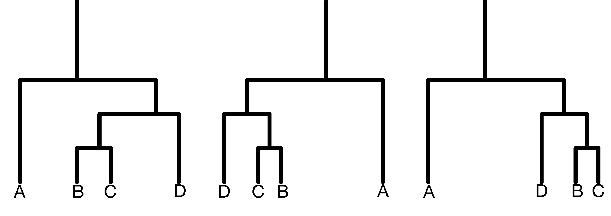

```{r setup, include=FALSE}
knitr::opts_chunk$set(echo = TRUE, comment = "", fig.align = "center",
                      fig.width = 5, fig.height = 3)

library(tidyverse)
theme_set(theme_minimal(base_family = "Avenir Next Condensed", base_line_size = 0))
```


```{css, echo=FALSE}
blockquote {
    padding: 10px 20px;
    margin: 0 0 20px;
    font-size: 12px;
    color: #828282;
    border-left: 14px solid #EEE;
}
```

****

Most of this notebook comes straight from Susan Holmes and Wolgang Huber's [__Modern Statistics for Modern Biology__](http://web.stanford.edu/class/bios221/book/index.html) [-@holmes2018modern, chap. 5].

It's about methods for finding meaningful clusters (or groups) in data.

_Note. These clustering methods will always find groups in data, even if there are none. Thus, we also focus on cluster **validation**_

_There are over 100 packages that provide clustering tools in [CRAN](https://CRAN.R-project.org/view=Cluster)._

****

## similarity

Clustering results will depend on the _features_ we choose and how they are combined into a single _distance metric_. What exactly do we mean by "similar"?

Here's a selection of choices:

- __Euclidean__. The Euclidean distance between two points $A = (a_1, \dots, a_p)$ and $B = (b_1, \dots, b_p)$ in a $p$-dimensional space (for the $p$ features) is the square root of the sum of squares of the differences in all $p$ coordinate directions.

    $$
    \textsf{dist}(A, B) = \sqrt{\sum_{i=1}^p (a_i - b_i)^2}
    $$

    ```{r}
    dist_euclidean <- function(a, b) sqrt(sum((a-b)^2))
    
    p <- 20
    a <- runif(p, min = 1, max = 10) 
    b <- runif(p, min = 1, max = 10) 
    
    dist_euclidean(a, b)
    ```


- __Manhattan__. It takes the sum of the absolute differences in all coordinates. It's also known as the City Block, Taxicab or $L_1$ distance.

    $$
    \textsf{dist}(A, B) = \sum_{i=1}^p | a_i - b_i |
    $$

    ```{r}
    dist_manhattan <- function(a, b) sum(abs(a - b))
    
    dist_manhattan(a, b)
    ```


- __Maximum__. The maximum of the absolute differences between coordinates is also called the $L_\infty$ distance.
    
    $$
    \textsf{dist}(A, B) = \max_i |a_i - b_i |
    $$

    ```{r}
    dist_maximum <- function(a, b) max(abs(a - b))
    
    dist_maximum(a, b)
    ```

- __Weighted Euclidean distance__. A generalization of the ordinary Euclidean distance, it gives different weights to different directions in feature space.

    A common example is the $\chi^2$ (chi-squared) distance, which is used to compare rows in contingency tables (the weight of each feature is the inverse of the expected value). 
    
    Another common example is the __Mahalanobis__ distance, "takes into account the fact that different features may have a different dynamic range, and that some features may be positively or negatively correlated with each other". The weights here are derived from the covariance matrix of the features. 

- __Jaccard Distance__. Occurrence of traits or features can be translated into presence and absence (and encoded as 1's and 0's). In such situations, _co-occurence is often more informative than co-absence._ For two vectors $A$ and $B$, we call $f_{11}$ the number of times a feature occurs in both vectors, $f_{00}$ the number of times a feature is co-absent, $f_{10}$ the number of times it occurs in $A$ but not $B$ (and vice versa with $f_{01}$). The Jaccard index is just:

    $$
    J(A, B) = \frac{f_{11}}{f_{10} + f_{01} + f_{11}}
    $$

    Essentially, we discard $f_{00}$. The Jaccard distance is then as follows:

    $$
    \textsf{dist}(A, B) = 1 - J(A, B) = \frac{f_{10} + f_{01}}{f_{10} + f_{01} + f_{11}}
    $$

    ```{r}
    x <- sample(c(0, 1), p, replace = TRUE)
    y <- sample(c(0, 1), p, replace = TRUE)
    str(list(x, y))
    
    dist_jaccard <- function(a, b) {
      
      stopifnot(all(a == 1 | a == 0), all(b == 1 | b == 0))
      
      f11 <- sum(a == 1 & b == 1)
      f10 <- sum(a == 1 & b == 0)
      f01 <- sum(a == 0 & b == 1)
      
      (f10 + f01) / (f10 + f01 + f11)
      
    }
    
    
    dist_jaccard(x, y)
    ```

- __Edit, Hamming__. This distance is the simplest way to compare character sequences. It simply counts the number of character substitutions between two character strings. This distance only applies to same length sequences. If you also allow for deletions and insertions, you end up with something called __Levenshtein distance__.

    The algorithm for calculating the minimum edit distance (i.e. minimum edit operations like _insertion_, _deletion_, and _substitution_) is implemented by giving each operation a "cost" and using _dynamic programming_. Here's an R implementation of the algorithm. For more information, see [Jurafsky & Martin (forthcoming)](https://web.stanford.edu/~jurafsky/slp3/).
    
    ```{r}
    dist_levenshtein <- function(a, b) {
      
      a <- unlist(strsplit(a, split = ""))
      b <- unlist(strsplit(b, split = ""))
      
      D <- array(NA, dim = c(length(a) + 1, length(b) + 1))
      D[1, ] <- 0:length(b)
      D[, 1] <- 0:length(a)
      
      sub_cost <- function(x, y) if (x == y) 0 else 2
      
      for (i in seq_along(a)) {
        for (j in seq_along(b)) {
          cost <- c(D[i, j + 1] + 1, D[i + 1, j] + 1, D[i, j] + sub_cost(a[i], b[j]))
          D[i + 1, j + 1] <- min(cost)
        }
      }
      return(D[length(a) + 1, length(b) + 1])
    }
    
    dist_levenshtein("andres", "andrea") ## delete + insert = 2 || substitute = 2
    dist_levenshtein("intention", "purpose")
    ```

****

We can also compare the distances between complex objects using other metrics that we won't cover here (e.g. shortest paths between nodes in graph).

>Distances and dissimilarities are also used to compare images, sounds, maps and documents. A distance can usefully encompass domain knowledge and, if carefully chosen, can lead to the solution of many hard problems involving heterogeneous data. 

****

The `dist()` function in R computes six distance metrics (euclidean, maximum, manhattan, canberra, binary, and minkowski) and outputs a vector of values sufficient to reconstruct the complete distance matrix. 

```{r}
c <- a + rnorm(p)
dist(rbind(a, b, c), "euclidean")
dist(rbind(a, b, c), "manhattan")
```

## partitioning methods

The EM algorithm and other forms of _parametric mixture modeling_ will not work well in high-dimensional settings (see ["curse of dimensionality"](https://en.wikipedia.org/wiki/Curse_of_dimensionality)). This is why instead we use __partitioning__ or __iterative relocation methods__.

For example, the __PAM__ (partitioning around medoids) method works as follows:

1. Start from a matrix of $p$ features measured on a set of $n$ observations.

2. Randomly pick $k$ distinct cluster centers out of the $n$ observations ("seeds").

    Recall that, besides the distance measure, _the main choice to be made is the number of clusters $k$._

3. Assign each of the remaining observations to the group whose center is closest.

4. For each group, _choose a new center from the observations in the group, such that the sum of the distances of group members to the center is minimal_. This is called _the medoid_.

5. Repeat steps 3 and 4 until the groups stabilize.

Note that different initial seeds will be picked in Step 2 each time the algorithm is run. This can lead to different final results. A popular implementation is the `cluster::pam()` function.

The __$k$-means method__ is a slight variation of this method: the medoids are replaced by the arithmetic means (centers of gravity) of the clusters. The `stats::kmeans()` function comes with every installation of R.

>These so-called $k$-methods are the most common off-the-shelf methods for clustering; they work particularly well when the clusters are of comparable size and convex (blob-shaped). On the other hand, if the true clusters are very different in size, the larger ones will tend to be broken up; the same is true for groups that have pronounced non-spherical or non-elliptic shapes.

At this point, this sounds very similar to what the EM-algorithm does. This is one of the main difference between them:

>In the EM algorithm, each point participates in the computation of the mean of all the groups through a probabilistic weight assigned to it. In the $k$-means method, the points are either attributed to a cluster or not, so each point participates only, and entirely, in the computation of the center of one cluster.

This is my implementation of the $k$-means clustering algorithm (`stats::kmeans()` is much faster, but the code is less concise):

```{r}
k_means_clustering <- function(X, k, max_iter = 300) {
  
  X <- as.matrix(X)
  clusters <- sample(1:k, nrow(X), replace = TRUE) ## initial random assignment
  
  # This function calculates rowwise euclidean distance
  dist_to_k <- function(k) apply(X, MARGIN = 1, function(x) sqrt(sum((x - centroids[k, ])^2)))
  
  iter <- 0
  
  repeat {
  
    centroids <- map(1:k, ~ X[clusters == .x, ]) %>% 
      map(colMeans) %>% 
      do.call(rbind, args = .)
  
    clusters_next <- map(1:k, dist_to_k) %>% 
      do.call(cbind, args = .) %>% 
      apply(MARGIN = 1, function(x) which(x == min(x))) ## rowise cluster assignment
    
    iter <- iter + 1
    
    if (identical(clusters_next, clusters) | iter >= max_iter) break
    
    clusters <- clusters_next
    
  }
  
  rownames(centroids) <- 1:k
  return(list(clusters = unname(clusters), centroids = centroids, iterations = iter))
  
}

k_means_clustering(datasets::faithful, k = 2)
```

We can obtain __tight clusters__ by repeating this process many times (using different initial values or resampled datasets) and identifying groups of observations that are _almost always_ grouped together. Paying attention to these tight clusters will facilitate in choosing the right number of $k$ clusters.

### density-based clustering

As mentioned earlier, $k$-methods tend to work well when the hidden groups are convex (i.e. blob-shaped) and of comparable size. If the data isn't structured like this, we have to use other partitioning methods such as __density-based clustering__. This method looks for regions of high density that are separated by sparser regions.

A common implemenation of such a method is available in the __`dbscan`__ package.

_An example_

```{r}
n <- 300
theta <- runif(n, 0, 2 * pi) 
r <- rnorm(n, 10)
non_blob_data <- bind_rows(
  tibble(x = rnorm(n), y = rnorm(n)),
  tibble(x = r*cos(theta), y = r*sin(theta))
)

ggplot(non_blob_data, aes(x, y)) + geom_point() + labs(title = "non-blob shaped data")
```

```{r}
km_output <- kmeans(non_blob_data, centers = 2)
ggplot(non_blob_data, aes(x, y)) + 
  geom_point(aes(color = factor(km_output$cluster))) + 
  labs(title = "k-means clustering", color = "cluster")


library(dbscan)

db_output <- dbscan(non_blob_data, eps = 2.5) 
ggplot(non_blob_data, aes(x, y)) + 
  geom_point(aes(color = factor(db_output$cluster))) + 
  labs(title = "density-based clustering", color = "cluster")
```

The __dbscan method__ will cluster points in accordance to the _density-connectedness criterion._ It looks at small neighborhood spheres of radius $\epsilon$ to see if points are connected. 

We say that a point $a$ is __density-reachable__ from $b$ if there's a sequence of points $a_1, ..., a_n$ such that $a_{i + 1}$ and $a_i$ are within $\epsilon$ distance from each other, and $a_n = b$. Thus, a cluster is just a subset of mutually density-connected points.

_Note. The size of $\epsilon$ increases with the number of $p$ dimensions due to the "curse of dimensionality"_.

## agglomerative methods

Hierarchical clustering is a bottom-up approach. Each observation starts as a cluster of its own, and then gets sequentially combined into larger clusters.

This nested (or hierarchical) organization is usually portrayed with __dendrograms__. The following figure shows three representations of the _same_ hierarchical clustering tree. Note that vertical distances are informative but that horizontal distances are essentially meaningless.

```{r, echo=FALSE, out.width="400px"}

```


###### 5.6.1 How to compute (dis)similarities between aggregated clusters?


!!!!!


```{r}
dendrogram <- as.dendrogram(hclust(dist(iris[, 1:4])))


unclass(dendrogram) %>% View


library(ggraph)
ggraph(dendrogram, layout = "dendrogram") + 
  geom_edge_bend() 
```


## validation

## references

```{r}
rnorm(10)
```


```{css}


```


```
This time I <em>really</em> mean it!
```


